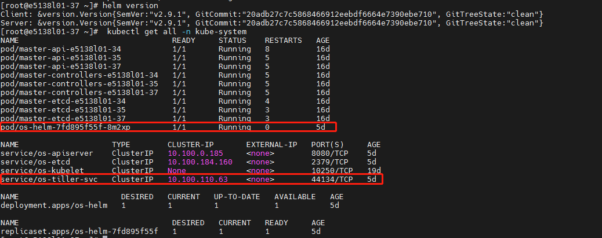

#### Kubernetes基础模块

1. 创建Kubernetes集群

   ```bash
   minikube start	# 创建一个单节点的kubernetes
   kubectl get nodes	# 获取节点
   kubectl cluster-info	# 查看集群信息
   ```

2. 部署应用

   ```bash
   # 使用kubectl run部署一个应用
   kubectl run 应用名 --image=镜像地址 --port=应用对外服务的端口号
   # Deployment是Kubernetes的术语，理解为应用；Pod是容器的集合，通常会将紧密相关的一组容器放到一个Pod中，同一个Pod中的所有容器共享IP地址和Port空间，也就是说它们在一个network namespace中。Pod是Kubernetes调度的最小单位，同一Pod中的容器始终被一起调度。
   kubectl get pods	# 获取当前的pod
   ```

3. 访问应用

   ```bash
   # 默认情况下，所有Pod只能在集群内部访问。为了能够从外部访问应用，需要将容器的端口映射到节点的端口，使用kubectl expose映射到节点的端口
   kubectl expose deployment/应用名 --type="NodePort" --port 节点端口
   kubectl get services	# 获取已部署的服务
   ```

4. 扩容与缩容

   ```bash
   # 使用kubectl scale使当前pod增加到3个，通过curl访问应用，每次请求发送到不同的Pod，3个副本轮询处理，这样就实现了负载均衡
   kubectl scale deployments/应用名 --replicas=3	# 将副本数增加到3个
   # 要scale down也很方便
   kubectl scale deployments/应用名 --replicas=2
   kubectl get deployments
   ```

5. 滚动更新

   ```bash
   # 从原有v1镜像升级到v2
   kubectl set image deployments/应用名 应用名=镜像:v2
   # 回退到v1版本
   kubectl rollout undo deployments/应用名
   ```

#### Kubernetes重要概念

**Cluster**是计算、存储和网络资源的集合，Kubernetes利用这些资源运行各种基于容器的应用。

**Master**是Cluster的大脑，它的主要职责是调度，即决定将应用放在哪里运行。为了实现高可用，可以运行多个Master。

**Node**的职责是运行容器应用。Node由Master管理，Node负责监控并汇报容器的状态，同时根据Master的要求管理容器的生命周期。

**Pod**是Kubernetes的最小工作单元。每个Pod包含一个或多个容器。Pod中的容器会作为一个整体被Master调度到一个Node上运行。

**Controller**：Kubernetes通常不会直接创建Pod，而是通过Controller来管理Pod的。Kubernetes提供了多种Controller，包括Deployment、ReplicaSet、DaemonSet、StatefuleSet、Job等

**Service**定义了外界访问一组特定Pod的方式。Service有自己的IP和端口，Service为Pod提供了负载均衡。Kubernetes运行容器（Pod）与访问容器（Pod）这两项任务分别由Controller和Service执行。

**Namespace**将一个物理的Cluster逻辑上划分成多个虚拟Cluster，每个Cluster就是一个Namespace。不同Namespace里的资源是完全隔离的。

Kubernetes默认创建了两个Namespace

- default：创建资源时如果不指定，将被放到这个Namespace中。
- kube-system：Kubernetes自己创建的系统资源将放到这个Namespace中。

#### 部署Kubernetes Cluster

官方安装文档：https://kubernetes.io/docs/setup/independent/install-kubeadm/

1. 所有节点主机都需要安装docker

2. 所有节点上安装kubelet、kubeadm和kubectl

   - kubelet运行在Cluster所有节点上，负责启动Pod和容器
   - kubeadm用于初始化Cluster
   - kubectl是Kubernetes命令行工具。通过kubectl可以部署和管理应用，查看各种资源，创建、删除和更新各种组件

3. 用kubeadm创建Cluster

   官方文档：https://kubernetes.io/docs/setup/independent/create-cluster-kubeadm/

   1. 初始化Master

      ```bash
      # --apiserver-advertise-address指明用Master的哪个interface与Cluster的其他节点通信，如果不指定，kubeadm会自动选择有默认网关的interface
      # --pod-network-cidr指定Pod网络的范围
      kubeadm init --apiserver-advertise-address 192.168.56.105 --pod-network-cidr=10.244.0.0/16
      初始化过程：
      	1.kubeadm执行初始化前的检查
      	2.生成token和证书
      	3.生成KubeConfig文件，kubelet需要用这个文件与Master通信
      	4.安装Master组件，会从Google的Registry下载组件的Docker镜像
      	5.安装附加组件kube-proxy和kube-dns
      	6.Kubernetes Master初始化成功
      	7.提示如何配置kubectl
      	8.提示如何安装Pod网络
      	9.提示如何注册其他节点到Cluster
      ```

   2. 配置kubectl

   3. 安装Pod网络：网络解决方案：flannel、canal...

   4. 添加k8s-node1和k8s-node2

      ```bash
      # -token来自前面kubeadm init输出的第9步提示，如果当时没有记录下来，可以通过kubeadm token list查看
      kubeadm join --token xxxx 192.168.56.105:6443
      ```

#### Kubernetes架构

Kubernetes Cluster由Master和Node组成，节点上运行着若干Kubernetes服务

Master是Kubernetes Cluster的大脑，运行着的Daemon服务包括kube-apiserver、kube-scheduler、kube-controller-manager、etcd和Pod网络

1. API Server（kube-apiserver）：Kubernetes Cluster的前端接口，各种客户端工具（CLI或UI）以及Kubernetes其他组件可以通过它管理Cluster的各种资源
2. Scheduler（kube-scheduler）：决定将Pod放在哪个Node上运行
3. Controller Manager（kube-controller-manager）：负责管理Cluster各种资源，保证资源处于预期的状态。Controller Manager由多种controller组成，包括replication controller、endpoints controller、namespace controller、serviceaccounts controller等
4. etcd：负责保存Kubernetes Cluster的配置信息和各种资源的状态信息
5. Pod网络：Pod要能够相互通信，Kubernetes Cluster必须部署Pod网络

Node是Pod运行的地方，Node上运行的Kubernetes组件有kubelet、kube-proxy和Pod网络

1. kubelet是Node的agent，当Scheduler确定在某个Node上运行Pod后，会将Pod的具体配置信息（image、volume等）发送给该节点的kubelet，kubelet根据这些信息创建和运行容器，并向Master报告运行状态
2. kube-proxy：每个Node都会运行kube-proxy服务，它负责将访问service的TCP/UPD数据流转发到后端的容器。如果有多个副本，kube-proxy会实现负载均衡

```bash
# 部署一个应用为例
kubectl run 应用名 --image=镜像地址 --replicas=2
1.kubectl发送部署请求到API Server
2.API Server通知Controller Manager创建一个deployment资源
3.Scheduler执行调度任务
4.各自的节点上创建并运行Pod
注：应用的配置和当前状态信息保存在etcd中，执行kubectl get pod时API Server会从etcd中读取这些数据；flannel会为每个Pod都分配IP。因为没有创建service，所以目前kube-proxy还没参与进来
```

#### 运行应用

##### Deployment

运行Deployment

1. 用户通过kubectl创建Deployment
2. Deployment创建ReplicaSet
3. ReplicaSet创建Pod

创建应用的方式

1. 使用kubectl命令直接创建，如“kubectl run nginx-deployment --image=nginx:1.7.9--replicas=2”，在命令行中通过参数指定资源的属性

2. 通过配置文件和**kubectl apply**创建，可执行命令“kubectl apply -f nginx.yml”，nginx.yml内容如下：

   ```yaml
   apiVersion: extensions/v1beta1
   kind: Deployment
   metadata:
   	name: nginx-deployment
   spec:
   	replicas: 2
   	template:
   		metadata:
   			labels:
   				app: web_server
   		spec:
   			containers:
   				name: nginx
   				image: nginx: 1.7.9
   			nodeSelector：
   				disktype=ssd
   ```

命令vs配置文件

1. 命令方式：简单、直观、快捷，上手快，适合临时测试或实验
2. 基于配置文件的方式：配置文件描述了What，即应用最终要达到的状态；配置文件提供了创建资源的模板，能够重复部署；可以像管理代码一样管理部署；适合正式的、跨环境的、规模化部署；要求熟悉配置文件的语法，有一定难度。

Deployment配置文件

- apiVersion是当前配置格式的版本
- kind是要创建的资源类型，这里是Deployment
- metadata是该资源的元数据，name是必需的元数据项
- spec部分是该Deployment的规格说明
  - replicas指明副本数量，默认为1
  - template定义Pod的模板，这是配置文件的重要部分
    - metadata定义Pod的元数据，至少要定义一个label。label的key和value可以任意指定
    - spec描述Pod的规格，此部分定义Pod中每一个容器的属性，name和image是必需的
      - spec里通过nodeSelector指定将此Pod部署到具有label disktype=ssd的Node上

lable控制pod位置：Kubernetes是通过label来实现Pod部署到指定的Node。已部署应用后删除label，Pod并不会重新部署。相当于配置文件中的nodeSelector

##### DaemonSet

Deployment部署的副本Pod会分布在各个Node上，每个Node都可能运行好几个副本。DaemonSet的不同之处在于：每个Node上最多只能运行一个副本

DaemonSet的典型应用场景有：

1. 在集群的每个节点上运行存储Daemon
2. 在每个节点上运行日志收集Daemon
3. 在每个节点上运行监控Daemon

DaemonSet配置文件：

- DaemonSet配置文件的语法和结构与Deployment几乎完全一样，只是将kind设为DaemonSet
- hostName相当于docker run --network=host
- containers定义了运行服务的容器

##### Job

容器按照持续运行的时间可分为两类：服务类容器和工作类容器

服务类容器通常持续提供服务，需要一直运行。工作类容器则是一次性任务，比如批处理程序，完成后容器就退出。

Kubernetes的Deployment、ReplicaSet和DaemonSet都用于管理服务类容器；对于工作类容器，我们使用Job。

Job配置文件

- kind类型为Job
- restartPolicy指定什么情况下需要重启容器。对于Job，只能设置为Never或者OnFailure。对于其他controller（比如Deployment），可以设置为Always。
- parallelism同时运行多个Pod
- completions设置Job成功完成Pod的总数
- 定时Job：kind类型为CronJob，schedule指定什么时候运行Job，其格式与Linux cron一致，jobTemplate定义Job的模板(与前面一致)

#### 通过service访问pod

##### 创建service

Kubernetes Service从逻辑上代表了一组Pod，具体是哪些Pod则是由label来挑选的。

service配置文件：

- apiVersion: V1，Service的版本
- kind: Service，当前资源的类型为Service
- name: httpd-svc，Service的名字
- selector指明挑选那些label为run: httpd的Pod作为Service的后端
- protcol: TCP，使用TCP协议
- port: 8080 targetPort: 80，将service的8080端口映射到pod的80端口

##### 外网访问service

1. ClusterIP：Service通过Cluster内部的IP对外提供服务，只有Cluster内的节点和Pod可访问，这是默认的Service类型
2. NodePort：Service通过Cluster节点的静态端口对外提供服务。Cluster外部可以通过<NodeIP>:<NodePort>访问Service
3. LoadBalance：Service利用cloud provider特有的load balancer对外提供服务，cloud provider负责将load balancer的流量导向Service

应用的service访问方式改为nodeport，kubectl edit svc os-redis-svc（ports字段下面加了一个 nodePort: 6379 ，把type的值改成了 NodePort）

#### 滚动升级

##### 滚动更新

一次只更新一小部分副本，成功后再更新更多的副本，最终完成所有副本的更新。滚动更新的最大好处是零停机，整个更新过程始终有副本在运行，从而保证了业务的连续性。

kubectl describe deployment 应用，可以查看每次更新替换一个pod

##### 回滚

kubectl apply每次更新应用时，Kubernetes都会记录下当前的配置，保存为一个revision（版次），这样就可以回滚到某个特定revision。

默认配置下，Kubernetes只会保留最近的几个revision，可以在Deployment配置文件中通过revisionHistoryLimit属性增加revision数量。

通过`kubectl apply -f xxx.yml --record`部署更新应用，--record的作用是将当前命令记录到revision记录中。使用`kubectl rollout history deployment 应用`，查看revison历史记录。使用`kubectl rollout undo deployment httpd --to-revision=revison版本数`回滚到指定版本

#### 健康检查

- 默认的健康检查

  每个容器启动时都会执行一个进程，此进程由Dockerfile的CMD或ENTRYPOINT指定。如果进程退出时返回码非零，则认为容器发生故障，Kubernetes就会根据restartPolicy重启容器。

- Liveness探测

  让用户可以自定义判断容器是否健康的条件。如果探测失败，Kubernetes就会重启容器。

- Readiness探测

  告诉Kubernetes什么时候可以将容器加入到Service负载均衡池中，对外提供服务。

#### 数据管理

##### Volume

本质上，Kubernetes Volume是一个目录，这一点与Docker Volume类似。Kubernetes Volume也支持多种backend类型，包括emptyDir、hostPath、GCE Persistent Disk、AWS Elastic Block Store、NFS、Ceph等。

- emptyDir

  emptyDir是最基础的Volume类型，是Host上的一个空目录。

  emptyDir Volume的生命周期与Pod一致。

  其优点是能够方便地为Pod中的容器提供共享存储，不需要额外的配置。它不具备持久性，如果Pod不存在了，emptyDir也就没有了。

- hostPath

  hostPath Volume的作用是将Docker Host文件系统中已经存在的目录mount给Pod的容器。

  大部分应用都不会使用hostPath Volume，因为这实际上增加了Pod与节点的耦合，限制了Pod的使用。

  hostPath的持久性比emptyDir强。不过一旦Host崩溃，hostPath也就无法访问了。

- 外部Storage Provider

##### PersistentVolume & PersistentVolumeClaim

PersistentVolume（PV）是外部存储系统中的一块存储空间，由管理员创建和维护。与Volume一样，PV具有持久性，生命周期独立于Pod。

PersistentVolumeClaim （PVC）是对PV的申请（Claim）。PVC通常由普通用户创建和维护。需要为Pod分配存储资源时，用户可以创建一个PVC，指明存储资源的容量大小和访问模式（比如只读）等信息，Kubernetes会查找并提供满足条件的PV。

#### Secret & Configmap

应用启动过程中可能需要一些敏感信息，比如访问数据库的用户名、密码或者密钥。将这些信息直接保存在容器镜像中显然不妥，Kubernetes提供的解决方案是Secret。

##### 创建Secret

1. 通过--from-literal

   ```bash
   # 每个--from-literal对应一个信息条目
   kubectl create secret generic mysercret --from-literal=username=admin --from-literal=password=123456
   ```

2. 通过--from-file

   ```bash
   # 每个文件内容对应一个信息条目
   echo -n admin > ./username
   echo -n 123456 > ./password
   kubectl create secret generic mysercret --from-file=./username --from-file=./password
   ```

3. 通过--from-env-file

   ```bash
   # 文件env.txt中每行Key=Value对应一个信息条目
   cat << EOF >> env.txt
   username=admin
   password=123456
   EOF
   kubectl create secret generic mysercret --from-env-file=env.txt
   ```

4. 通过YAML配置文件，执行kubectl apply创建Secret

   ```bash
   # yaml文件内容，文件中的敏感数据必须是通过base64编码后的结果（echo -n admin | base64）
   apiVersion: v1
   kind: Secret
   metadata:
   	name: mysercret
   data:
   	username: YWRtaW4=
   	password: MTIzNDU2
   ```

##### 查看sercet

```bash
kubectl get secret mysercret	# 查看存在的secret
kubectl describe secret mysercret	# 查看条目的Key
kubectl edit secret mysecret	# 查看条目的Value
echo -n 条目的value | base64 --decode	# 通过base64将Value反编码
```

##### pod中使用secret

1. Volume方式
   - ①定义volume foo，来源为secret mysecret
   - ②将foo mount到容器路径/etc/foo，可指定读写权限为readOnly。
2. 自定义存放数据的文件名
3. 环境变量方式

注：环境变量读取Secret很方便，但无法支撑Secret动态更新。

Secret可以为Pod提供密码、Token、私钥等敏感数据；对于一些非敏感数据，比如应用的配置信息，则可以用ConfigMap。ConfigMap的创建和使用方式与Secret非常类似，主要的不同是数据以明文的形式存放。与Secret一样，ConfigMap也支持四种创建方式

#### Helm包

Kubernetes的包管理器

##### Heml架构

helm-Kubernetes的包管理器。每个成功的软件平台都有一个优秀的打包系统，比如Debian、Ubuntu的apt，Red Hat、CentOS的yum。Helm则是Kubernetes上的包管理器。

Helm有两个重要的概念：chart和release

- chart是创建一个应用的信息集合，包括各种Kubernetes对象的配置模板、参数定义、依赖关系、文档说明等。
- release是chart的运行实例，代表了一个正在运行的应用。

Helm是包管理工具，这里的包就是指的chart。Helm能够：

- 从零创建新chart
- 与存储chart的仓库交互，拉取、保存和更新chart
- 在Kubernetes集群中安装和卸载release
- 更新、回滚和测试release

Helm包含两个组件：Helm客户端和Tiller服务器

- Helm客户端负责管理chart
- Tiller服务器负责管理release



##### 使用Helm

```bash
helm search	# 查看当前可安装的chart
helm repo list	# 查看仓库列表(默认仓库：stable和local)
helm install stable/mysql	# 安装chart即可安装mysql
```

##### chart目录结构

- Chart.yaml：描述chart的概要信息，name和version是必填项，其他都是可选项。

- values.yaml：提供了chart在安装时根据参数进行定制化配置

- templates目录：各类Kubernetes资源的配置模板都放置在这里。Helm会将values.yaml中的参数值注入模板中，生成标准的YAML配置文件。

  - NOTES.txt：chart的简易使用文档

  - deployment.yaml

    - {{ template "mysql.fullname" . }}：引用一个子模板(templates/_helpers.tpl)定义的mysql.fullname，**Chart**和**Release**是Helm预定义的对象，每个对象都有自己的属性，可以在模板中使用

      ```bash
      # 在templates/_helpers.tpl定义
      {{ .Chart.Name }}的值为mysql
      {{ .Release.Name }}的值为my
      # 那在deployment.yaml引入
      {{ template "mysql.fullname".}}计算结果为my-mysql
      ```

    - Values也是预定义的对象，代表的是values.yaml文件。

- README.md：chart的使用文档，此文件为可选

- LICENSE：chart的许可信息，此文件为可选

- requirements.yaml：chart可能依赖其他的chart，这些依赖关系可通过requirements.yaml指定

##### 定制自己的chart

1. 创建chart myapp
   - **helm create myapp**：创建目录myapp，并生成各类chart文件。在此基础上开发自己的chart
   - 新建chart默认包含一个nginx应用示例
2. 打包安装chart
   - **helm lint myapp**：检查chart语法正确性
   - **helm package myapp**：打包自定义的chart
   - **helm install myapp.tgz**：通过tar包安装chart
   - helm install --dry-run myapp --debug：模拟安装chart，并输出每个模板生成的YAML内容

#### Kubernetes常用命令

```bash
kubectl describe pod <pod name>	# 查看pod的具体情况
kubectl get deployment <deployment name>	# 查看应用状态
kubectl get deployment <deployment name>	# 查看应用详细信息
kubectl describe replicaset	<ReplicaSet name>	# 查看副本详细信息
kubectl apply -f nginx.yml	# 通过yaml文件部署应用
kubectl delete deployment <deployment name>	# 删除资源，也可以使用yaml文件删除：kubectl delete -f nginx.yml
kubectl get node --show-labels	# 查看节点的标签
kubectl label node <节点> <label>	# 给节点打标签，label是key-value对
kubectl label node <节点> <lable的key>-	# 删除标签，-即删除
kubectl edit deployment <deployment name>	# 查看应用配置和运行状态
```

